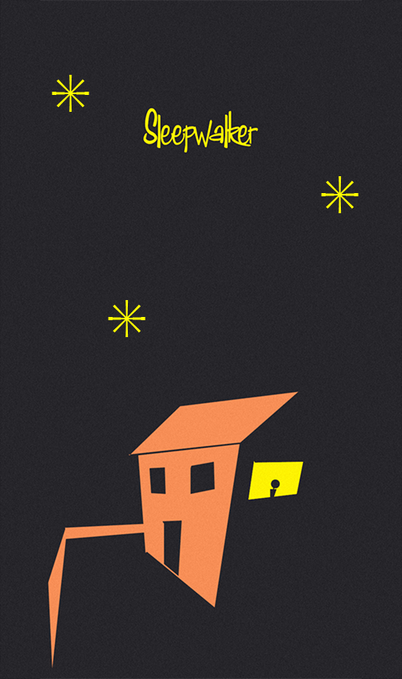

Sleepwalker
===

Night, night...
---

It's late. You're tired. You drift off to sleep listening to the ticking of the clock at the foot of your bed. 

Tick...

Tock...

Tick...

Tock...

You're awake. Are you? It's dark. You can still hear your clock... tick... tock... but it's further away. Now you're standing up. This isn't your bedroom. It's dark. Wake up. Walk to the clock.

Tick...

Tock...

Play
---

Put on your headphones and use the arrow keys to walk towards the ticking noise. Walk as close to it as you can to continue to the next level.

[Demo (Chrome only)](http://apps.angryrobotzombie.com/sleepwalker)

Technology
---

This is the first few levels of a game designed around the positional audio available in the Web Audio API. Underneath, it's based on [this Canvas raycasting demo](http://dev.opera.com/articles/view/creating-pseudo-3d-games-with-html-5-can-1/) by [Jacob Seidelin](http://blog.nihilogic.dk/). It was built In June 2012 but then sat around my unfinished folder for about a year before I decided I'd probably never finish it.

At the moment, it only works in Chrome and must be run from a local server. On OS X, navigate to the folder from terminal and run 

    python -m SimpleHTTPServer
    
Then you can play the game at `http://localhost:8000/`

License
---

The game concept and design is [MIT licence](http://thingsinjars.mit-license.org/). My usual addendum is that if you use this stuff and make a huge pile of cash from it, I'd appreciate it if you bought me a bigger TV. That'd be nice of you.

A large portion of the code is Jacob Seidelin's under a Creative Commons Attribution, Non Commercial - Share Alike 2.5 license.

### Sounds

From [freesound.org](http://freesound.org) 

  * pigs_breathing.MP3 by oyez -- http://www.freesound.org/people/oyez/sounds/7386/ -- License: Attribution Noncommercial
  * babbling brook 2.wav by juskiddink -- http://www.freesound.org/people/juskiddink/sounds/60485/ -- License: Attribution
  * ClockTicksInsideDoorClosed.wav by daveincamas -- http://www.freesound.org/people/daveincamas/sounds/27078/ -- License: Attribution
  * Footsteps - concrete - OD - B.wav by FreqMan -- http://www.freesound.org/people/FreqMan/sounds/31368/ -- License: Attribution